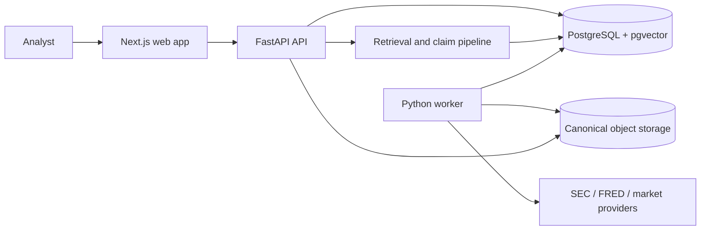

# Financial Evidence Lab

[](https://github.com/wilsonhj/financial-evidence-lab/actions/workflows/ci.yml)
[](./LICENSE)

Financial Evidence Lab is an evidence-first workspace for researching public
companies. It connects filing ingestion, point-in-time search, verifiable
claims, structured extraction, and financial modeling without losing the
source behind a number or conclusion.

The project is deliberately **mock-first**. You can explore the reader and
Search Observatory without credentials, then add PostgreSQL and live providers
when you need the complete data path.

> This is active pre-release software. The reader, hybrid-retrieval, and
> structured-extraction foundations are implemented mock-first, while financial
> modeling and forecasting remain roadmap work.

## What works today

Status as of **2026-07-30** on `main` (`61058e4`):

| Area                          | State                               | What that means                                                                                                                                                                                                                                  |
| ----------------------------- | ----------------------------------- | ------------------------------------------------------------------------------------------------------------------------------------------------------------------------------------------------------------------------------------------------ |
| Platform foundation           | Implemented                         | Workspace APIs, mock authentication, tenant-scoped RLS, audit/cost primitives, PostgreSQL jobs, and CI are in place.                                                                                                                             |
| Evidence ingestion and reader | Implemented, with live gates open   | SEC ingestion, immutable document versions, canonical spans/facts, a composite reader API, and the Next.js evidence reader work in tests and mock mode. The 20-issuer live corpus gate and hosted end-to-end smoke are still open.               |
| Hybrid retrieval and claims   | Implemented, mock-first             | Dense, lexical, fact, and table lanes, deterministic planning/RRF, replayable traces, feedback, claim decomposition, and the Search Observatory are present. Live embedding/generation selection and the 65-question acceptance run remain open. |
| Structured extraction         | Implemented, mock-first             | The v0.4 API/database/provider foundation, the `packages/ontology` SaaS metric ontology, and the durable extraction worker are all on `main`: typed extraction roles, a checkpointed workflow FSM, normalization, deterministic validators, hard budget enforcement, and atomic persistence. Live-provider extraction and the confidence/review gates are open. |
| Modeling and forecasting      | Not implemented                     | M4 and M5 are specified but should not be treated as runnable product features.                                                                                                                                                                  |

The authoritative product requirements live in
[`specs/001-financial-evidence-lab/`](./specs/001-financial-evidence-lab/).
GitHub issues and pull requests are the live source for delivery state; the
handoff snapshots can lag recent merges.

## Try the UI in five minutes

You need Node 22 and Corepack. The fixture mode does not require Python,
PostgreSQL, or API keys.

```sh
corepack enable
corepack pnpm install --frozen-lockfile
FEL_EVIDENCE_SOURCE=fixture corepack pnpm --filter @fel/web dev
```

Open:

- <http://localhost:3000> for the filing list and evidence reader
- <http://localhost:3000/observatory> for retrieval inspection

Fixture mode is explicit by design; there is no silent production fallback.
For a database-backed setup, see
[`docs/development/local.md`](./docs/development/local.md).

## How the system fits together



Three rules shape the design:

1. **Point-in-time by default.** A query or direct document read must not see
   information published after its effective cutoff.
2. **Evidence is immutable.** Document content, spans, hashes, facts, retrieval
   traces, and calculation lineage are versioned instead of silently rewritten.
3. **Failures are explicit.** Missing credentials, unsupported provider modes,
   corrupt evidence, and incomplete configuration fail closed rather than
   returning plausible-looking results.

Read the [architecture overview](./docs/architecture/overview.md) for component
boundaries and the [system design](./docs/architecture/system-design.md) for
data flow, tenancy, temporal behavior, and failure semantics.

## Repository map

```text
apps/api/                    FastAPI routes and database-backed services
apps/web/                    Next.js reader and Search Observatory
workers/                     Job consumer, ingestion pipelines, extraction runtime
packages/contracts/          Versioned JSON Schema/OpenAPI contracts
packages/ontology/           SaaS metric ontology, comparability keys, loader
packages/providers/          Provider protocols and deterministic mocks
packages/retrieval/          Chunking, retrieval, fusion, traces, and claims
packages/retrieval-evals/    Retrieval benchmark and evaluation tooling
db/migrations/               Append-only PostgreSQL migrations
db/seeds/                    Seed data for local and test databases
evals/                       Cross-stack fixtures and graders
infra/                       Railway service definitions
scripts/                     Repository tooling invoked by make and CI
specs/                       Canonical product/specification packages
.specify/                    Constitution and Spec Kit memory
docs/architecture/           System overview and design
docs/decisions/              Architecture decision records
docs/development/            Local setup and testing guides
docs/handoff/                Agent work queue and status snapshots
docs/research/               Research studies and package proposals
docs/runbooks/               Operator runbooks for deployed services
```

## Development setup

Supported toolchain:

- Node.js 22 (`.node-version`)
- pnpm 10.33 through Corepack (`packageManager` in `package.json`)
- Python 3.11 (`.python-version`)
- PostgreSQL with pgvector for database-backed tests and services

```sh
corepack enable
corepack pnpm install --frozen-lockfile

python3.11 -m venv .venv
.venv/bin/pip install --upgrade pip
.venv/bin/pip install -r requirements-dev.txt
```

If `python3.11` is not on your `PATH`, do not substitute another interpreter
silently — `.python-version` pins 3.11 and CI builds against it.
[`docs/development/local.md`](./docs/development/local.md) is the canonical
source for the toolchain, including how to obtain 3.11 and what to check if
`python3` resolves elsewhere. Prefer it over this summary if the two ever
disagree.

Run the fast, database-independent checks:

```sh
corepack pnpm run test
.venv/bin/pytest
```

Database-gated Python tests skip when `TEST_DATABASE_URL` is absent. CI runs
those suites against PostgreSQL 17 with pgvector. See the
[testing guide](./docs/development/testing.md) for the complete matrix and
recommended developer loops.

## API and runtime modes

The implemented API includes:

- workspace create/list/update with idempotency and optimistic concurrency
- corpus, span, and version-pinned composite reader endpoints
- retrieval query, rerun, event, result, and feedback endpoints
- health and structured error responses

Authentication is currently development-only: `FEL_AUTH_MODE=mock` uses
unsigned mock tokens while database membership remains authoritative. A production
Supabase/JWKS verifier has not shipped.

The web reader has two explicit server-side modes:

- `FEL_EVIDENCE_SOURCE=fixture` — deterministic local demonstration
- `FEL_EVIDENCE_SOURCE=http` — authenticated FastAPI reader calls

Server tokens must never be exposed to client components. Full environment
configuration is documented in
[`docs/development/local.md`](./docs/development/local.md).

## Current blockers and open decisions

The nearest critical path is:

1. Settle two extraction-validation gaps deferred out of the M3 runtime, both of
   which move persisted identity keys and therefore need an ADR before
   implementation: unit-case handling is inconsistent across the identity,
   duplicate, and definition checks
   ([#153](https://github.com/wilsonhj/financial-evidence-lab/issues/153)), and
   guidance-range ordering is polarity-blind while never firing at all for
   free-text metric ids
   ([#154](https://github.com/wilsonhj/financial-evidence-lab/issues/154)).
2. Decide how a terminal extraction run relates to queue retries in
   [issue #146](https://github.com/wilsonhj/financial-evidence-lab/issues/146).
3. Finish the production reader smoke
   ([#108](https://github.com/wilsonhj/financial-evidence-lab/issues/108)) and
   preserve integrity errors instead of flattening every server error into a
   generic outage.
4. Run the live SEC corpus gates
   ([#56](https://github.com/wilsonhj/financial-evidence-lab/issues/56),
   [#81](https://github.com/wilsonhj/financial-evidence-lab/issues/81)).
5. Select live embedding/generation providers and execute the checksum-pinned
   65-question retrieval gate
   ([#132](https://github.com/wilsonhj/financial-evidence-lab/issues/132)).
   This may require an ADR update because current provider direction is not
   fully reconciled with ADR-0002.
6. Complete M3 review/confidence work, then begin M4 modeling and M5
   forecasting.

There are also repository-governance decisions for dependency-only shared-path
changes ([#141](https://github.com/wilsonhj/financial-evidence-lab/issues/141))
and scheduled dependency auditing
([#143](https://github.com/wilsonhj/financial-evidence-lab/issues/143)).

See [system design: known gaps](./docs/architecture/system-design.md#known-gaps-and-open-decisions)
for details.

## Contributing

1. Read [`AGENTS.md`](./AGENTS.md) and the
   [contributor operating model](./docs/handoff/README.md).
2. Start from the current `main` and claim one GitHub issue/work package.
3. Keep path ownership non-overlapping. Shared contract, migration, ADR, and
   handoff files require the repository's contract-change process.
4. Add tests for behavior changes and run the relevant local gates.
5. Open a draft pull request early, then attach exact test and review evidence.

Good first contributions are focused documentation, test coverage, developer
tooling, or a narrowly scoped issue with no shared-path collision. Report
security issues privately to the repository maintainers rather than opening a
public exploit report.

## Further reading

- [Architecture overview](./docs/architecture/overview.md)
- [System design](./docs/architecture/system-design.md)
- [Local development](./docs/development/local.md)
- [Testing guide](./docs/development/testing.md)
- [Extraction worker runbook](./docs/runbooks/extraction-worker.md)
- [Canonical specification](./specs/001-financial-evidence-lab/spec.md)
- [MVP stack ADR](./docs/decisions/ADR-0002-mvp-stack.md)
- [Contract package](./packages/contracts/README.md)

`SPEC.md`, `PLAN.md`, and `TASKS.md` at the repository root are pointer stubs
into [`specs/001-financial-evidence-lab/`](./specs/001-financial-evidence-lab/).
They carry no normative content — read the spec package instead.

## License

Apache-2.0. See [`LICENSE`](./LICENSE).
