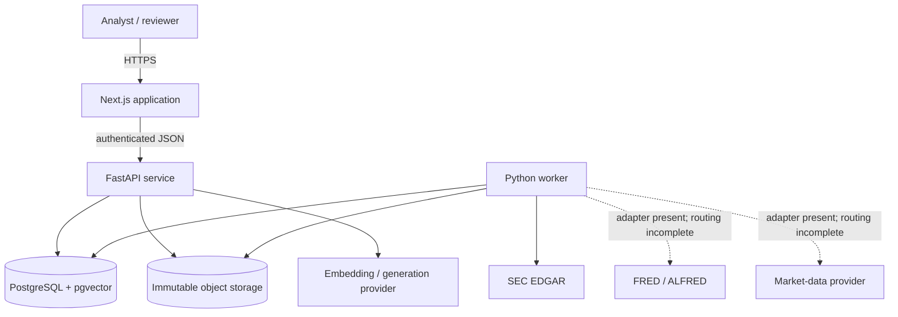
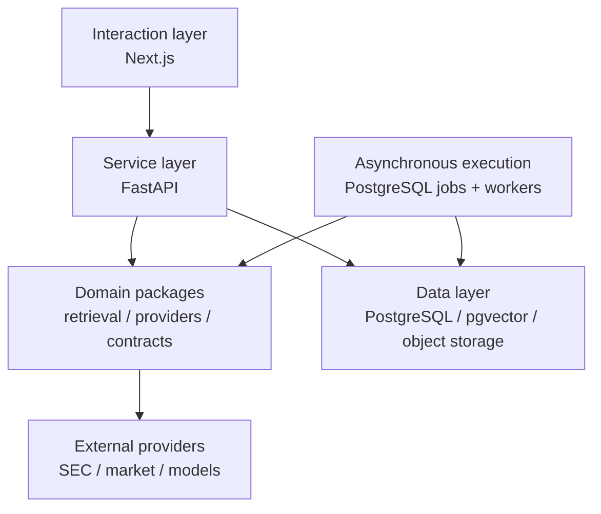
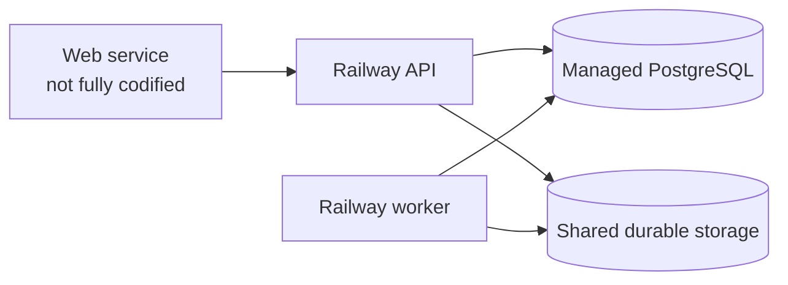

# Architecture overview

This document describes the architecture that is present on `main`, not only
the target product. Planned components are labeled so a new contributor can
tell which paths are safe to run, extend, or depend on.

## Product boundary

Financial Evidence Lab turns public-company source material into auditable
research:

1. ingest and version primary-source documents and facts;
2. retrieve evidence under a point-in-time cutoff;
3. decompose answers into claims and citations;
4. extract structured financial concepts;
5. build models and forecasts with traceable calculation lineage.

Steps 1–3 are implemented in mock-first form. Step 4 has merged contracts and
database foundations, with runtime implementation under review. Step 5 is
roadmap work.

## System context

PostgreSQL is the coordination and metadata backbone. Immutable filing bodies
live behind storage object keys; structured provenance, spans, facts, jobs,
retrieval indexes, runs, and audit records live in PostgreSQL.

## Containers and responsibilities

| Container/package                   | Responsibility                                                                                         | Current maturity                                       |
| ----------------------------------- | ------------------------------------------------------------------------------------------------------ | ------------------------------------------------------ |
| `apps/web`                          | Evidence Reader, Search Observatory, run comparison, server-side API integration                       | Implemented in fixture and HTTP modes                  |
| `apps/api`                          | Authentication boundary, RLS transaction setup, workspaces, corpus/reader, retrieval and feedback APIs | Implemented; production auth is pending                |
| `workers`                           | Durable job claiming, SEC discovery/fetch/company-facts ingestion, leases and retries                  | Implemented for SEC paths                              |
| `packages/retrieval`                | Chunking, lane retrieval, deterministic plan/fusion, traces, claims, replay                            | Implemented, mock-provider first                       |
| `packages/providers`                | Stable external-provider protocols and deterministic mocks                                             | Interfaces/mocks implemented; live coverage is partial |
| `packages/contracts`                | Versioned JSON Schemas, OpenAPI descriptions, generated TypeScript types                               | Implemented through M3 contract v0.4                   |
| `db/migrations`                     | Tenant, corpus, retrieval, extraction, queue, and RLS schema                                           | Implemented through migration `0005`                   |
| `evals`, `packages/retrieval-evals` | Cross-stack fixtures, graders, and retrieval benchmarks                                                | Synthetic gates implemented; live gates open           |
| Extraction runtime                  | Ontology and durable extraction workflow                                                               | Under review in PR #145                                |
| Calculation/forecast packages       | Scenario model, forecast, backtest, release UI                                                         | Planned                                                |

## Architectural layers

The layers are intentionally boring:

- UI code does not query PostgreSQL directly.
- API requests enter a tenant-scoped transaction before application queries.
- Workers claim jobs without holding a transaction during provider calls.
- Provider SDKs stay behind repository-owned interfaces.
- Contracts are versioned and generated; application packages consume them
  rather than maintaining private mirrors.

## Data ownership and migration groups

Migrations are append-only:

| Migration                                 | Major ownership                                                                               |
| ----------------------------------------- | --------------------------------------------------------------------------------------------- |
| `0001_platform_core.sql`                  | organizations, membership, workspaces, audit, usage, PostgreSQL jobs                          |
| `0002_corpus_core.sql`                    | entities, documents, versions, sections, spans, facts, corpus versions, quarantine, ingestion |
| `0003_retrieval_core.sql`                 | retrieval indexes/items, queries, runs, events, claims, feedback                              |
| `0004_extraction_core.sql`                | extraction runs, proposals, evidence, conflicts, review/correction foundations                |
| `0005_retrieval_query_guard_role_fix.sql` | retrieval query guard/RLS role correction                                                     |

Application code must never modify an old migration to repair deployed state;
use a new migration and the repository's contract-change process.

## Trust boundaries

### Browser to Next.js

The browser receives rendered data and client-safe state. API bearer tokens and
provider credentials stay in server-only environment variables. The web
runtime configuration module deliberately imports Node-only APIs so accidental
client imports fail at build time.

### Next.js to FastAPI

HTTP mode sends an authenticated request to FastAPI. The web adapter preserves
typed not-found, validation, authentication, and outage states, although
integrity-error classification still needs hardening before the hosted reader
gate can close.

### FastAPI to PostgreSQL

The API verifies identity, looks up membership, begins a transaction, applies
request claims, and switches to `fel_app`. RLS is the final tenant boundary.
Evidence-corpus tables are shared/read-only to the application by design;
analysis/workspace data is organization-scoped.

### Worker to external providers

Workers use repository-owned provider interfaces, explicit modes, timeouts,
leases, and idempotency keys. Live SEC execution requires a fair-access user
agent and durable storage. Provider output is untrusted input and must pass
schema, provenance, and financial validation before promotion.

## Deployment topology

The current deployment assets define separate Railway API and worker services.
They share PostgreSQL and must share durable evidence storage. A production web
service definition, Supabase/JWKS authentication, hosted object-storage
adapter, Sentry wiring, and the full hosted reader smoke are not complete.

Do not deploy API and worker with process-local storage paths that point to
different disks: citations will resolve in the database but canonical content
will be unreadable.

## Architecture invariants

The following are compatibility requirements, not implementation preferences:

- **Temporal correctness:** every source carries a publication/availability
  time and every read honors an effective cutoff.
- **Determinism:** persisted ranks, scores, decimals, versions, and ordering
  rules make a run reproducible.
- **Evidence integrity:** offsets are document-global, text slices are
  hash-verified, and cross-version evidence is rejected.
- **Tenant isolation:** organization-owned data is protected by RLS under a
  non-owner application role.
- **Immutable lineage:** published corpus/index versions and accepted results
  are superseded, not overwritten in place.
- **Fail closed:** incomplete configuration, unknown modes, corrupt evidence,
  and unsupported live providers stop execution explicitly.
- **Bounded cost:** operations reserve/check budgets and record usage; hard
  enforcement for the M3 runtime is still a review gate.

## Sources of truth

Use each artifact for its intended purpose:

1. [`constitution.md`](../../.specify/memory/constitution.md) — non-negotiable
   product and engineering principles.
2. [`spec.md`](../../specs/001-financial-evidence-lab/spec.md) — canonical
   product requirements.
3. [`plan.md`](../../specs/001-financial-evidence-lab/plan.md) and
   [`tasks.md`](../../specs/001-financial-evidence-lab/tasks.md) — intended
   implementation sequence and gates.
4. [`docs/decisions`](../decisions/) — accepted and proposed architecture
   decisions.
5. [`packages/contracts`](../../packages/contracts/) and
   [`db/migrations`](../../db/migrations/) — executable compatibility surface.
6. GitHub issues, pull requests, and current `main` — live delivery state.
7. [`docs/handoff`](../handoff/) — coordination snapshots; useful, but they can
   lag recent merges and must be reconciled before dispatch.

For lower-level behavior and current gaps, read
[`system-design.md`](./system-design.md).
