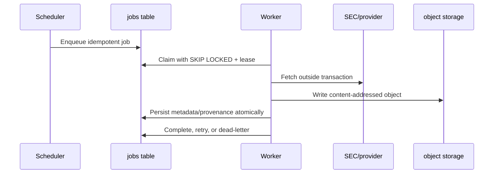
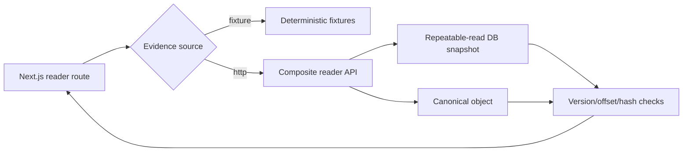
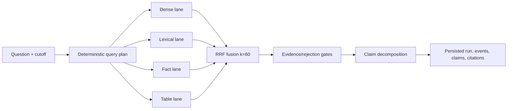

# System design

This guide explains how Financial Evidence Lab preserves tenant, temporal, and
evidence correctness across ingestion, retrieval, and review. It is aimed at a
developer changing runtime behavior, schemas, or service boundaries.

## Design goals

The system is optimized for:

- a defensible answer over a merely fluent answer;
- reproducible point-in-time research;
- immutable evidence and calculation lineage;
- transparent retrieval and validation decisions;
- deterministic mock execution in CI;
- explicit provider and deployment boundaries;
- safe parallel development through versioned contracts.

It is not currently optimized for:

- anonymous public access;
- low-latency streaming generation at scale;
- arbitrary document formats beyond the supported financial corpus;
- automatic acceptance of model output;
- completed financial modeling or forecasting workflows.

## Identity, tenancy, and authorization

An authenticated principal has a user identity, but authorization comes from
the active database membership.

```mermaid
sequenceDiagram
    participant Client
    participant API
    participant Auth
    participant DB as PostgreSQL

    Client->>API: Bearer token
    API->>Auth: Verify identity claims
    Auth->>DB: Resolve active organization membership
    DB-->>Auth: Canonical role and membership
    API->>DB: BEGIN; SET LOCAL request claims; SET LOCAL ROLE fel_app
    API->>DB: Execute tenant-scoped query
    DB-->>API: RLS-filtered result
    API-->>Client: Typed response
```

Important properties:

- The role asserted by a mock token is not authoritative.
- API database connections do not execute application queries as a table owner.
- Request claims are transaction-local so pooled connections cannot leak
  tenant context.
- Organization-owned workspace, query, run, feedback, extraction, and review
  records are RLS-scoped.
- The source corpus is shared and application-read-only by design. Workers
  curate it; organizations create private analysis over it.

`FEL_AUTH_MODE=mock` is the only implemented verifier. Production Supabase/JWKS
verification is still required.

## Temporal model

Every research action resolves an **effective cutoff**. A valid source must be
known by that instant:

```text
available_at <= effective_as_of
```

The rule applies to both collection endpoints and direct reads. A user must not
be able to bypass a cutoff by guessing a document or version URL.

The composite reader accepts optional cutoff and corpus-version pins. It:

1. opens a read-only, repeatable-read transaction;
2. resolves the visible target and related documents under the cutoff;
3. selects one parsed document version deterministically;
4. loads sections, spans, and facts only from that selected version;
5. returns the effective cutoff and corpus version in the response.

Exact cutoff boundaries are inclusive. Future siblings, draft corpus versions,
quarantined versions, and cross-version evidence are excluded.

## Ingestion and evidence storage

### Job flow



Workers keep claim transactions short. A lease heartbeat makes abandoned jobs
recoverable. Idempotency keys prevent repeated scheduler or webhook delivery
from creating duplicate logical work.

The deployed consumer currently dispatches SEC discovery, filing fetch, and
company-facts ingestion. FRED and market-data adapters exist, but their live
job routing is not complete.

### Document identity

Do not conflate these IDs:

- a **document** is a logical filing;
- a **document version** is one immutable parse/content version;
- a **corpus version** is an immutable set of approved document versions;
- a **retrieval index version** is built from exactly one published corpus
  version.

Canonical text is stored as an immutable object. PostgreSQL records its object
key, checksum, metadata, sections, spans, facts, and quarantine state.

### Coordinates and hashes

Persisted section and span offsets are canonical **document-global** character
offsets. UI-local highlighting derives:

```text
local_start = span.start_char - section.start_char
local_end   = span.end_char   - section.start_char
```

The derived slice must match the stored hash. A span outside its section, a
hash mismatch, or evidence from another selected version is an integrity
failure—not an empty result.

## Reader request path

The reader uses one authenticated composite endpoint rather than assembling a
page from independently versioned calls. This ensures sections, spans, facts,
corpus version, cutoff, and selected document version come from one snapshot.



HTTP and fixture modes are explicit. Production must never fall back to fixture
data. A remaining blocker is that the web adapter maps API 5xx responses too
broadly: an `INTEGRITY_ERROR` can appear as generic unavailability. Invalid or
draft corpus pins also need a distinct path so they do not masquerade as a
missing document.

## Retrieval pipeline

### Index construction

The item builder creates stable, provenance-rich retrieval items from published
corpus versions:

- text chunks with deterministic boundaries;
- structured financial facts;
- table-derived items;
- vector representations limited by the frozen 512-dimension contract.

Publishing an index pins its corpus version, provider/model identity, chunking
configuration, and build metadata. Published inputs are immutable so replay
does not drift.

### Query execution



The trace records lane contributions, ranks, scores, decisions, versions, and
rejection reasons. Reruns consume immutable inputs; feedback is tied to a
specific run and candidate.

The current API executes the pipeline before returning its nominal `202`
response. Runs are therefore synchronous-terminal today. The event endpoint
replays committed events; it is not a live asynchronous SSE producer. A true
live producer/consumer is deferred and must be added before M3 depends on
real-time progress semantics.

### Current provider limitation

Only deterministic mock embedding and structured-generation providers are
wired into the production path. A live provider pin fails closed. The
65-question release gate must select and pin real providers at the required
dimension, run over a checksum-pinned corpus, and report retrieval/claim
metrics. The current mock claim decomposition also reuses evidence identity,
so it is not evidence of live numerical verification quality.

## Extraction boundary

On `main`, M3 provides:

- v0.4 JSON Schema/OpenAPI contracts;
- extraction/provider protocols and deterministic mocks;
- database tables, RLS, transition guards, proposals, evidence, conflicts,
  review, and correction foundations.

The ontology and durable extraction worker are not merged. They are under
review in [PR #145](https://github.com/wilsonhj/financial-evidence-lab/pull/145).
Downstream code must not assume that PR's runtime is available on `main`.

A valid extraction design must:

- bind execution to immutable database-owned run/evidence inputs;
- validate the complete structured output, not only top-level keys;
- persist a logical batch and its provenance atomically;
- fence late provider responses after lease loss/cancellation;
- enforce wall-clock, attempt, token, and cost budgets durably;
- treat missing/invalid citations and financial normalization as blockers;
- preserve scale, unit, period, currency, and magnitude in duplicate/conflict
  identity;
- minimize sensitive/raw provider data in audit records.

## Failure, concurrency, and idempotency semantics

| Concern                          | Required behavior                                                             |
| -------------------------------- | ----------------------------------------------------------------------------- |
| Duplicate create requests        | Stable idempotency key returns the original logical result                    |
| Concurrent workspace update      | ETag/version precondition prevents lost updates                               |
| Queue claim                      | `FOR UPDATE SKIP LOCKED`, short claim transaction, expiring lease             |
| Worker crash                     | Lease expiry makes the job reclaimable; committed checkpoints are replay-safe |
| Provider timeout                 | Bounded call, recorded attempt, retry/dead-letter policy                      |
| Late response after cancellation | Fencing check prevents persistence or promotion                               |
| Evidence corruption              | Explicit integrity failure; never a false 404 or generic empty result         |
| Version conflict                 | Reject cross-version references before persistence/promotion                  |
| Partial logical batch            | Transaction rollback; no partially visible accepted result                    |

The unresolved M3 question is how a terminal extraction-run state relates to a
retryable queue job. The alternatives are tracked in
[issue #146](https://github.com/wilsonhj/financial-evidence-lab/issues/146);
the decision must align schema transitions, worker retry semantics, and API
observability.

## Cost and observability

The platform stores usage events and supports user/day and organization/month
soft and hard limits. Retrieval traces are first-class product data rather than
debug logs. Audit records should answer who changed or accepted what, when,
against which immutable inputs.

Never put bearer tokens, provider secrets, raw personal contact data, or
unbounded raw model payloads in logs/widgets/audit events. M3 hard-budget and
audit-minimization behavior remains a merge blocker.

## Deployment modes

| Mode               | Intended use                                      | Guarantees and limitations                                                           |
| ------------------ | ------------------------------------------------- | ------------------------------------------------------------------------------------ |
| Web fixture        | UI development and deterministic demos            | No API/database/provider coverage                                                    |
| Local mock stack   | API/worker/RLS integration without live providers | Requires PostgreSQL and shared local storage                                         |
| Live SEC ingestion | Corpus acceptance and parser testing              | Requires durable storage, SEC identity, and network access                           |
| Hosted production  | Target deployment                                 | Not complete; auth, storage, web deployment, telemetry, and hosted smoke remain open |

## Known gaps and open decisions

### Blocking the nearest milestone

- [PR #145](https://github.com/wilsonhj/financial-evidence-lab/pull/145)
  has unresolved high-severity M3 correctness findings covering durable input
  binding, validation, atomic persistence, lifecycle enforcement, financial
  validation, conflict identity, worker routing, and audit exposure.
- [Issue #146](https://github.com/wilsonhj/financial-evidence-lab/issues/146)
  needs a terminal-run/retry lifecycle decision.

### Reader and corpus acceptance

- [Issue #108](https://github.com/wilsonhj/financial-evidence-lab/issues/108)
  requires the real worker → PostgreSQL → FastAPI → HTTP source → production
  Next.js/browser smoke.
- Reader integrity and invalid corpus-pin errors must retain their meaning
  through the web adapter.
- [Issues #56](https://github.com/wilsonhj/financial-evidence-lab/issues/56)
  and [#81](https://github.com/wilsonhj/financial-evidence-lab/issues/81)
  require live SEC access and a compliant SEC identity.

### Retrieval release evidence

- [Issue #132](https://github.com/wilsonhj/financial-evidence-lab/issues/132)
  must select live embedding/generation providers and execute the
  checksum-pinned 65-question gate.
- Provider direction in the live-gate issue and ADR-0002 is not fully aligned;
  a superseding ADR may be necessary.
- True live SSE execution is deferred in
  [issue #135](https://github.com/wilsonhj/financial-evidence-lab/issues/135).
- Claim and numeric verification hardening remains tracked in
  [#137](https://github.com/wilsonhj/financial-evidence-lab/issues/137) and
  [#133](https://github.com/wilsonhj/financial-evidence-lab/issues/133).

### Production readiness and repository health

- Production Supabase/JWKS auth and hosted object storage are not implemented.
- The web production-service definition and full observability/telemetry are
  incomplete ([#138](https://github.com/wilsonhj/financial-evidence-lab/issues/138)).
- Accessibility/keyboard release evidence is open
  ([#136](https://github.com/wilsonhj/financial-evidence-lab/issues/136)).
- A policy decision is needed for dependency-only shared-path security changes
  ([#141](https://github.com/wilsonhj/financial-evidence-lab/issues/141)).
- Scheduled dependency auditing remains open
  ([#143](https://github.com/wilsonhj/financial-evidence-lab/issues/143)).
- Some coordination artifacts and issues lag merged work (for example, the
  Playwright CI implementation merged in PR #131 while its tracker remained
  open during this audit). Reconcile live GitHub state before dispatch.

## Change rules

Before changing contracts, migrations, or architecture:

1. read [`AGENTS.md`](../../AGENTS.md) and the repository constitution;
2. open/claim the relevant contract-change issue;
3. update or add an ADR when a frozen decision changes;
4. make migrations additive and preserve generated-contract drift checks;
5. include RLS-negative, temporal-boundary, replay, and failure-path tests;
6. attach exact verification evidence to the pull request.
