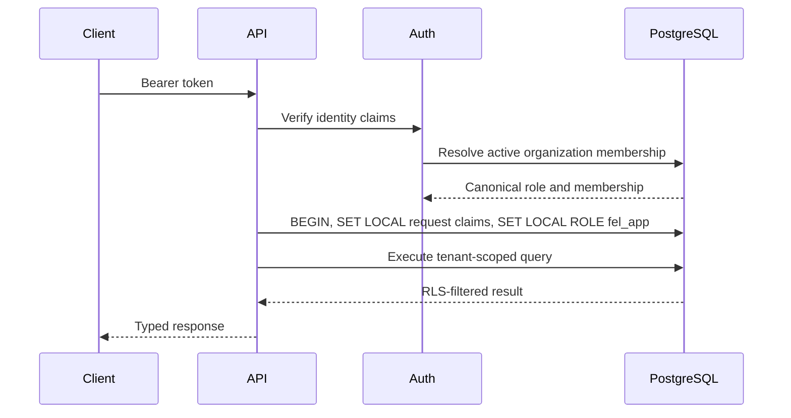
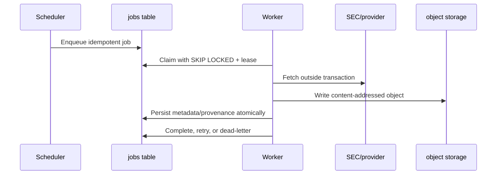
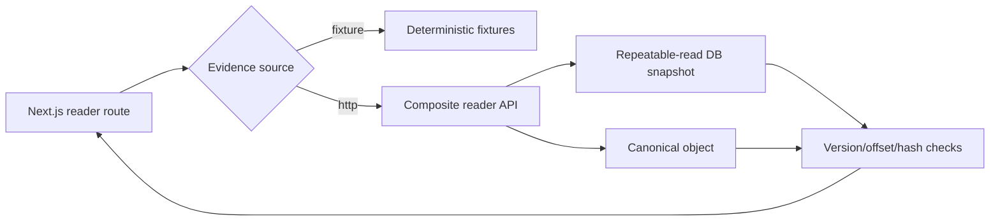
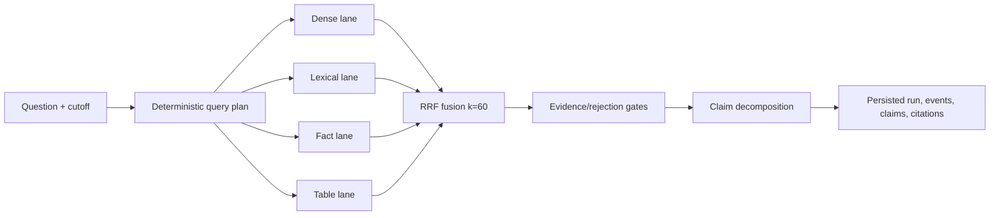

# System design

This guide explains how Financial Evidence Lab preserves tenant, temporal, and
evidence correctness across ingestion, retrieval, and review. It is aimed at a
developer changing runtime behavior, schemas, or service boundaries.

## Design goals

The system is optimized for:

- a defensible answer over a merely fluent answer;
- reproducible point-in-time research;
- immutable evidence and calculation lineage;
- transparent retrieval and validation decisions;
- deterministic mock execution in CI;
- explicit provider and deployment boundaries;
- safe parallel development through versioned contracts.

It is not currently optimized for:

- anonymous public access;
- low-latency streaming generation at scale;
- arbitrary document formats beyond the supported financial corpus;
- automatic acceptance of model output;
- completed financial modeling or forecasting workflows.

## Identity, tenancy, and authorization

An authenticated principal has a user identity, but authorization comes from
the active database membership.



Important properties:

- The role asserted by a mock token is not authoritative.
- API database connections do not execute application queries as a table owner.
- Request claims are transaction-local so pooled connections cannot leak
  tenant context.
- Organization-owned workspace, query, run, feedback, extraction, and review
  records are RLS-scoped.
- The source corpus is shared and application-read-only by design. Workers
  curate it; organizations create private analysis over it.

`FEL_AUTH_MODE=mock` is the only implemented verifier. Production Supabase/JWKS
verification is still required.

## Temporal model

Every research action resolves an **effective cutoff**. A valid source must be
known by that instant:

```text
published_at <= effective_as_of
```

`published_at` is the real column name — on `documents` (`db/migrations/0002_corpus_core.sql`)
and in every cutoff predicate (`apps/api/app/reader.py`). There is no
`available_at` anywhere in the schema or the code; grep for the name you see here.

The rule applies to both collection endpoints and direct reads. A user must not
be able to bypass a cutoff by guessing a document or version URL.

The composite reader accepts optional cutoff and corpus-version pins. It:

1. opens a read-only, repeatable-read transaction;
2. resolves the visible target and related documents under the cutoff;
3. selects one parsed document version deterministically;
4. loads sections, spans, and facts only from that selected version;
5. returns the effective cutoff and corpus version in the response.

Exact cutoff boundaries are inclusive. Future siblings, draft corpus versions,
quarantined versions, and cross-version evidence are excluded.

## Ingestion and evidence storage

### Job flow



Workers keep claim transactions short. A lease heartbeat makes abandoned jobs
recoverable. Idempotency keys prevent repeated scheduler or webhook delivery
from creating duplicate logical work.

The deployed consumer currently dispatches SEC discovery, filing fetch, and
company-facts ingestion. FRED and market-data adapters exist, but their live
job routing is not complete.

### Document identity

Do not conflate these IDs:

- a **document** is a logical filing;
- a **document version** is one immutable parse/content version;
- a **corpus version** is an immutable set of approved document versions;
- a **retrieval index version** is built from exactly one published corpus
  version.

Canonical text is stored as an immutable object. PostgreSQL records its object
key, checksum, metadata, sections, spans, facts, and quarantine state.

### Coordinates and hashes

Persisted section and span offsets are canonical **document-global** character
offsets. UI-local highlighting derives:

```text
local_start = span.start_char - section.start_char
local_end   = span.end_char   - section.start_char
```

The derived slice must match the stored hash. A span outside its section, a
hash mismatch, or evidence from another selected version is an integrity
failure—not an empty result.

## Reader request path

The reader uses one authenticated composite endpoint rather than assembling a
page from independently versioned calls. This ensures sections, spans, facts,
corpus version, cutoff, and selected document version come from one snapshot.



HTTP and fixture modes are explicit. Production must never fall back to fixture
data. A remaining blocker is that the web adapter maps API 5xx responses too
broadly: an `INTEGRITY_ERROR` can appear as generic unavailability. Invalid or
draft corpus pins also need a distinct path so they do not masquerade as a
missing document.

## Retrieval pipeline

### Index construction

The item builder creates stable, provenance-rich retrieval items from published
corpus versions:

- text chunks with deterministic boundaries;
- structured financial facts;
- table-derived items;
- vector representations limited by the frozen 512-dimension contract.

Publishing an index pins its corpus version, provider/model identity, chunking
configuration, and build metadata. Published inputs are immutable so replay
does not drift.

### Query execution



The trace records lane contributions, ranks, scores, decisions, versions, and
rejection reasons. Reruns consume immutable inputs; feedback is tied to a
specific run and candidate.

The current API executes the pipeline before returning its nominal `202`
response. Runs are therefore synchronous-terminal today. The event endpoint
replays committed events; it is not a live asynchronous SSE producer. A true
live producer/consumer is deferred and must be added before M3 depends on
real-time progress semantics.

### Current provider limitation

Only deterministic mock embedding and structured-generation providers are
wired into the production path. A live provider pin fails closed. The
65-question release gate must select and pin real providers at the required
dimension, run over a checksum-pinned corpus, and report retrieval/claim
metrics. The current mock claim decomposition also reuses evidence identity,
so it is not evidence of live numerical verification quality.

## Extraction boundary

On `main`, M3 ships a complete bounded extraction subsystem: v0.4 JSON
Schema/OpenAPI contracts, extraction/provider protocols and deterministic
mocks, migration `0004`'s tables/RLS/transition guards, a first-party ontology
package, and a durable, checkpointed worker FSM. The runtime merged as
`61058e4` (PR #145, closing #60); downstream code may assume it is present on
`main`. Its genuine remaining gaps are tracked below under
[Known gaps and open decisions](#known-gaps-and-open-decisions), not treated
as unmerged.

Operational detail (queue name, payload shape, budget defaults, the
memory-store opt-in) lives in
[`docs/runbooks/extraction-worker.md`](../runbooks/extraction-worker.md) and
[`workers/src/fel_workers/extraction/OPERATOR.md`](../../workers/src/fel_workers/extraction/OPERATOR.md).
This section covers the architecture.

### Ontology (`packages/ontology`)

- `fel_ontology/models.py` declares frozen dataclasses — `MetricDef` (id,
  canonical name, family, `kind`, `value_type`, unit, `period_semantics`,
  scale handling, aliases, required qualifiers, comparability-key fields,
  derivation/review policy), `Family`, `OntologyDocument` — and the `Literal`
  vocabularies (`ValueType`, `PeriodSemantics`, `MetricKind`) those fields are
  drawn from.
- `fel_ontology/loader.py::load_saas_metrics` loads and structurally validates
  `data/saas-metrics.v1.json`: it requires exactly 9 families and the 14
  expected metric ids (`arr`, `mrr`, `nrr`, `grr`, `cust_total`,
  `cust_threshold`, `seats`, `bookings`, `billings`, `rpo`, `crpo`,
  `deferred_rev`, `sub_gm`, `svc_gm`), that family membership exactly
  partitions the metric set, and that every enum field is a real member of its
  `Literal` alias (checked via `typing.get_args`, not restated as a separate
  list) so the loader and the type can never silently drift apart. It returns
  a `content_hash` of the raw file, which is pinned into extraction run
  requests and folded into every role's rendered instructions.
- `fel_ontology/comparability.py::build_comparability_key` builds a
  deterministic key from a metric's declared `comparability_key_fields` and
  the payload's qualifiers, failing closed (`KeyError`) on any missing
  required qualifier so an incomplete extraction is never silently treated as
  comparable to anything else. PR #75's golden tests assert
  _non_-comparability across construction/scope/window/alias-collision axes,
  plus a positive control.

### Typed roles (`extraction/`)

`roles/` itself holds only `__init__.py` and `base.py`; the prompts, schemas and
tool allowlist named below are its siblings under `extraction/`, which is why
`base.py` resolves them from `_PKG = ...parent.parent`.

Exactly five roles are registered (`extraction/types.py::Role`):
`classifier`, `fact_candidates`, `kpi`, `guidance`, `driver_mapper`. Each is a
`RoleSpec` (`roles/base.py`) pairing a versioned prompt (`prompts/*.v1.txt`),
a versioned JSON Schema (`schemas/*.json`), and a fixed read-only tool
allowlist (`tools.py`: `lookup_pinned_evidence`, `lookup_ontology_metric`,
`lookup_xbrl_facts`, `normalize_preview`, `validate_preview` — no role can
write). Evidence text is prompt-injection-delimited before it reaches a
model (`UNTRUSTED_OPEN`/`UNTRUSTED_CLOSE` markers, span markers stripped) so
filing content cannot be mistaken for instructions. The `kpi` and `guidance`
roles have the ontology's qualifier vocabulary rendered into their
instructions at load time (`render_qualifier_vocabulary`), generated from the
ontology rather than hand-copied so the prompt cannot drift from what it
describes; that vocabulary is part of `instructions_hash`, which is itself
part of the stage's content-addressed input hash, so a role invoked under a
changed ontology cannot resume from a checkpoint written under the old one.
Each model step allows at most one repair attempt (`MAX_ATTEMPTS = 2`); a
provider refusal is a typed `ProviderRefused` failure and is never converted
into an abstention (an injection vector otherwise).

### Durable workflow FSM (`extraction/workflow.py`)

`run_extraction_workflow` advances a `WorkflowState` through a fixed
`STAGE_ORDER`: `validate_request` → `assemble_evidence` → `classify` →
`collect_candidates` → the mode-gated `extract_kpi` / `extract_guidance` /
`extract_revenue_driver` → `normalize` → `validate` → `verify_citations` →
`detect_conflicts` → `persist_proposals`. Every stage boundary (`_boundary`)
checks the queue lease, cancellation, and the wall-clock budget before the
stage runs; every stage's durable write is re-fenced immediately beforehand
(`_commit_fence`), so a lease lost mid-stage commits nothing and the run's
real owner replays the (idempotent, content-hash-keyed) stage rather than
reading a zombie's output. Terminal outcomes append their event _before_
writing run status: migration `0004`'s `fel_assert_extraction_run_open`
rejects any child insert once a run row is terminal, so writing status first
silently drops the terminal event and replaces the real exception with the
guard's own error — this was PR #145 review finding B1, fixed on every
terminal exit (`run_failed` from both a typed and an untyped exception,
`run_cancelled`, and the abstention `run_succeeded`). `waiting_review` is the
only non-terminal outcome and always worked, which is why the memory-backed
happy-path tests never caught the ordering bug on the terminal ones. An
untyped exception still lands the run `failed` rather than leaving it
`running` forever, then re-raises so the queue also fails the job.

### Checkpoint / resume (`extraction/checkpoint.py`, `persist.py`)

Stage success is content-addressed —
`(run_id, step_name, input_hash, workflow_version)` — matching migration
`0004`'s partial unique index (`WHERE status = 'succeeded'`).
`MemoryCheckpointStore` is the in-memory double used by tests and mock E2E;
`PostgresCheckpointStore.commit_succeeded_atomic` commits a step row and its
`step_completed` event (the sole carrier of stage output, since `0004` has no
`steps.output` column) as one transaction, closing a defect where a crash
between the two separate writes left a durably `succeeded` step with no
recoverable output — resumed as a false "abstained, zero proposals" run
rather than a re-run of the lost stage. `_is_recoverable` rejects any
checkpoint that claims an output it cannot hand back rather than trusting a
torn row.

### Normalization (`extraction/normalize/`)

Decimal-only; float never touches a reported figure. `normalize/numeric.py`
parses a mantissa plus decimal-scale-exponent pair out of issuer text —
magnitude suffixes (`k`/`m`/`mm`/`b`/`bn`/`tn`/word forms), thousands
separators, and parenthesized-negative accounting notation — and fails closed
(`ValueError`) rather than guess at a partially-read number
(`_require_full_consumption`). `normalize/payload.py::normalize_payload`
reconciles a payload's numeric fields (e.g. a guidance range's `low`/`high`)
onto one shared scale by left-shifting only, so no bound is ever rounded;
validates a model-declared `scale` against `validate/range.py`'s bound before
anything trusts it; and cross-checks a declared `sign` against the value's
own derived sign, correcting the stored sign and reporting the disagreement
as a blocker rather than silently trusting the declaration. Period shape is
normalized by `normalize/period.py::normalize_period`, called from
`payload.py`. Dimensions and currency each have one live implementation in
their own module, alongside `period.py`:

- `normalize/dimensions.py::normalize_dimensions`, called from `payload.py`.
  It **reports** a non-string dimension value as a `dimensions_non_string`
  blocker instead of coercing it. The private `payload.py` variant it replaced
  ran `str()` over every key and value first, so `{"segment": 42}` reached
  review as a schema-clean `{"segment": "42"}` and the contract's own
  `{string: string}` check in `validate/schema.py` could never fire. Offending
  keys are dropped individually; valid siblings survive, which matters because
  `dimensions` is part of the duplicate/conflict identity key.
- `normalize/currency.py::normalize_currency`, called from
  `_normalize_numeric_fields`. It keeps the ISO-4217 validation that was
  inline before and adds `currency_missing_for_monetary`, which had existed
  as unreferenced code. `validate/definitions.py` only covers a metric the
  ontology resolves, so guidance and revenue drivers — which carry free-text
  metric labels by design — could previously report a monetary amount with a
  null currency and clear every check.

Both blockers travel on the non-aborting `NORMALIZER_BLOCKERS_KEY` channel, so
an affected payload reaches review named and explained rather than being
dropped.

Extend these modules, not `payload.py`: as of
[issue #155](https://github.com/wilsonhj/financial-evidence-lab/issues/155)
they are the live path, and the private duplicates are gone. In particular the
currency-fold question in
[issue #153](https://github.com/wilsonhj/financial-evidence-lab/issues/153)
is now localized to `normalize/currency.py`. The line that decision would
change is the `_ISO_4217` pattern, which rejects `"usd"` before the
subsequent `.upper()` is ever reached — that `.upper()` is a no-op today and
changing it alone would do nothing.

### Deterministic validators (`extraction/validate/`)

- `schema.py` validates every payload variant against the frozen
  `extraction-payload/v1` contract
  (`packages/contracts/schemas/extraction-payload.schema.json`), including
  that no field rides through beyond what the contract's
  `additionalProperties: false` closes.
- `accounting.py` carries per-payload rules (the `svc_gm` blended-margin
  prohibition, percent plausibility computed on the _scaled_ magnitude,
  billings-derivation lineage, cRPO timing verification) and cross-payload
  arithmetic identities required by spec M3-VAL-001
  (`identity_errors`: cRPO never exceeds RPO, single-dimension segments sum to
  their total, gross profit equals revenue minus |COGS|). Every comparison
  reconstructs a magnitude from the stored mantissa + scale pair
  (`_magnitude`) and compares within a _relative_ tolerance, so two payloads
  for the same figure restated at different scales, or with routine reporting
  noise, do not false-positive; each identity applies `abs()` only where the
  arithmetic requires it (the subtracted COGS term; both sides of the
  cRPO/RPO comparison; never in the additive segment-sum check), because a
  parenthesized-negative accounting presentation is reachable through the
  same normalizer that fixed the paren-parsing defect.
- `range.py` checks Decimal-parseability and a scale bound (`0`–`12`), plus
  `check_range`'s low ≤ high ordering for `guidance`/`range` payloads — see
  [issue #154](https://github.com/wilsonhj/financial-evidence-lab/issues/154)
  under Known gaps for two open defects in that specific check.
- `citations.py` blocks a proposal that cites no evidence and one whose every
  citation is membership-only (`partial`): only an asserted `text_hash` that
  matches the pinned span proves the citing role actually opened it.
- `duplicates.py` separates fact identity (`comparability_key_for`: kind,
  metric, entity, period, unit, currency, dimensions, qualifiers) from
  economic content (`value_fingerprint`, scale-independent via
  `canonical_magnitude`), so duplicate grouping and conflict grouping can
  never disagree about what makes two payloads the same fact.
- `conflicts.py` groups proposals by ontology comparability key when one is
  available, so non-comparable definitions (e.g. NRR under different
  `base_quantity`) never share a conflict bucket, flagging
  `value_disagreement` and/or `duplicate_candidate`.
- `definitions.py` cross-checks a KPI's unit/currency/period against what its
  ontology metric's `value_type`/`period_semantics` can express, and flags a
  proposal's free-text `definition` when it collides with another metric's
  alias.

### Budget enforcement (`extraction/budget.py`)

`RunBudget` mirrors `extraction_runs`' cap/usage columns in-process: a
pre-call `precheck` refuses a call that would exceed the calls, input-token,
output-token, cost, or wall-clock cap, and a post-call `record` hard-stops
(raising `BudgetExceeded`) if a single call overshoots after the fact — both
directions are enforced, not only the pre-call estimate. Usage carries across
queue attempts of the same run
(`PostgresPersistStore.load_usage`/`record_usage`), merged with SQL
`GREATEST` under the row lock so a stale worker's snapshot — reachable
because a dead heartbeat lets the reaper hand the job to a second worker
while the first still believes it owns it — can never erase a faster
worker's larger spend; the wall-clock counter gets the same treatment,
reading `MAX` over every `budget_updated` event for the run rather than only
the most recently appended one, because frozen `0004` has no column for it.

### Persistence (`extraction/persist.py`)

Every proposal is written `needs_review`; there is no code path that writes
`accepted` (`_ensure_needs_review` asserts it on every write, and the
workflow re-asserts it after persistence). `PostgresPersistStore.persist_outputs_atomic`
commits proposals, their evidence, and their conflicts in one transaction —
fixed after review found the non-atomic three-write sequence could leave
proposals durable with no conflict membership when the conflict write raised
(`0004`'s `conflict_terminal` guard is the reachable trigger), which was
unrepairable: `0004` forbids `DELETE` on these tables and blocks moving a
terminal run's proposals to `rejected`. `RunPins`, read back from the row
rather than trusted from the queue payload, are the authority on a run's
cutoff, corpus, model, and budget ceilings, so a payload cannot assert its
own identity.

### How the extraction design requirements are met

Every item below was a design requirement before the runtime existed; each
now has a concrete implementation to point to.

| Requirement                                                                          | How it is met                                                                                                                                                |
| ------------------------------------------------------------------------------------ | ------------------------------------------------------------------------------------------------------------------------------------------------------------ |
| Bind execution to immutable database-owned run/evidence inputs                       | `RunPins`/`SpanPin` (`persist.py`) read the run and cited spans back from Postgres rather than trusting the queue payload                                    |
| Validate the complete structured output, not only top-level keys                     | `validate/schema.py` closes every payload variant against the frozen contract; `accounting.py`/`range.py`/`definitions.py`/`citations.py` grade content      |
| Persist a logical batch and its provenance atomically                                | `persist_outputs_atomic` (proposals + evidence + conflicts, one transaction); `commit_succeeded_atomic` (step row + `step_completed` event, one transaction) |
| Fence late provider responses after lease loss/cancellation                          | `_boundary` (stage entry) and `_commit_fence` (stage exit) both check `lease_check`/`cancel_check`                                                           |
| Enforce wall-clock, attempt, token, and cost budgets durably                         | `RunBudget.precheck`/`record` (`budget.py`), usage merged with `GREATEST` across queue attempts                                                              |
| Treat missing/invalid citations and financial normalization as blockers              | `citations.py` (uncited/unverified proposals blocked); `normalize/payload.py` fails closed on unparseable/out-of-range values                                |
| Preserve scale, unit, period, currency, and magnitude in duplicate/conflict identity | `duplicates.py::comparability_key_for` + `value_fingerprint`; `accounting.py::_magnitude`                                                                    |
| Minimize sensitive/raw provider data in audit records                                | `redact.py` (queue-owned error sinks) and `events.py::redact_payload` (extraction event payloads); see the M4 open question under Known gaps                 |

## Failure, concurrency, and idempotency semantics

| Concern                          | Required behavior                                                             |
| -------------------------------- | ----------------------------------------------------------------------------- |
| Duplicate create requests        | Stable idempotency key returns the original logical result                    |
| Concurrent workspace update      | ETag/version precondition prevents lost updates                               |
| Queue claim                      | `FOR UPDATE SKIP LOCKED`, short claim transaction, expiring lease             |
| Worker crash                     | Lease expiry makes the job reclaimable; committed checkpoints are replay-safe |
| Provider timeout                 | Bounded call, recorded attempt, retry/dead-letter policy                      |
| Late response after cancellation | Fencing check prevents persistence or promotion                               |
| Evidence corruption              | Explicit integrity failure; never a false 404 or generic empty result         |
| Version conflict                 | Reject cross-version references before persistence/promotion                  |
| Partial logical batch            | Transaction rollback; no partially visible accepted result                    |

The unresolved M3 question is how a terminal extraction-run state relates to a
retryable queue job. The alternatives are tracked in
[issue #146](https://github.com/wilsonhj/financial-evidence-lab/issues/146);
the decision must align schema transitions, worker retry semantics, and API
observability.

## Cost and observability

The platform stores usage events and supports user/day and organization/month
soft and hard limits. Retrieval traces are first-class product data rather than
debug logs. Audit records should answer who changed or accepted what, when,
against which immutable inputs.

Never put bearer tokens, provider secrets, raw personal contact data, or
unbounded raw model payloads in logs/widgets/audit events. The M3 extraction
runtime enforces this with a hard budget (`extraction/budget.py`, see
[Extraction boundary](#extraction-boundary)) and two redaction layers:
`fel_workers/redact.py` (positional masking for the shared `jobs.error` /
`extraction_run_steps.error` sinks — credential shapes and quoted runs, since
those columns can carry document-derived text such as
`f"cannot normalize raw_value {value!r}"`) and
`extraction/events.py::redact_payload` (key-based masking for extraction
event payloads, with one deliberate exception: a `step_completed` event's
`stage_output` is the durable checkpoint payload — migration `0004` has no
`steps.output` column — so it is exempted from _truncation_, though its
sensitive-key substitution still runs). Whether that sensitive-key
substitution running inside `stage_output` is itself a defect (it can corrupt
`raw_payload_hash` on rehydration if an issuer-supplied qualifier or dimension
key happens to collide with a redacted key name, e.g. `token`) was
investigated during PR #145 review and assessed a false positive — closed
variants of the frozen payload schema were enumerated and only `text`
collides, which is already exempted — but a formal ruling closing or
re-opening that question is still pending.

## Deployment modes

| Mode               | Intended use                                      | Guarantees and limitations                                                           |
| ------------------ | ------------------------------------------------- | ------------------------------------------------------------------------------------ |
| Web fixture        | UI development and deterministic demos            | No API/database/provider coverage                                                    |
| Local mock stack   | API/worker/RLS integration without live providers | Requires PostgreSQL and shared local storage                                         |
| Live SEC ingestion | Corpus acceptance and parser testing              | Requires durable storage, SEC identity, and network access                           |
| Hosted production  | Target deployment                                 | Not complete; auth, storage, web deployment, telemetry, and hosted smoke remain open |

## Known gaps and open decisions

### Extraction runtime (M3)

The runtime described in [Extraction boundary](#extraction-boundary) is
merged and its review-blocking correctness findings (durable input binding,
atomic persistence, terminal-event ordering, financial-identity polarity,
conflict identity, worker routing, audit exposure) are fixed. What remains
open:

- [Issue #153](https://github.com/wilsonhj/financial-evidence-lab/issues/153)
  — `unit` case handling is inconsistent across the identity
  (`validate/accounting.py::_facts`), duplicate/conflict
  (`validate/duplicates.py::comparability_key_for`), and definition
  (`validate/definitions.py::_unit_errors`) checkers. A one-sided fold
  (`_facts` only) was tried during PR #145 review and reverted: it merged
  `'usd'`/`'USD'` rows into one identity slice, `_sole` correctly backed off
  to `validate/conflicts.py`, but conflicts is keyed on the _unfolded_ unit
  and never saw the pair — a real identity break became invisible with no
  blocker from any checker, strictly worse than the under-merge gap the fold
  was meant to close. A correct fix needs one canonical unit policy applied
  consistently everywhere at once, which is a contract question (persisted
  proposal/conflict ids may shift), hence an issue rather than a one-line
  edit.
- [Issue #154](https://github.com/wilsonhj/financial-evidence-lab/issues/154)
  — two defects in guidance-range ordering. `validate/range.py::check_range`
  compares raw signed Decimal bounds; since `low`/`high` route through the
  same parens-aware parser as every other numeric field, an ordinary
  worsening margin range (e.g. `svc_gm` guidance of `-5%` to `-15%`, written
  `low="(5)"`, `high="(15)"` in filing order) normalizes to `low=-5,
high=-15` and is spuriously blocked as `range_low_gt_high` — no schema or
  prompt anywhere actually states that `low` must be the numerically smaller
  bound. Separately, `check_range` never runs at all for a `guidance`
  payload whose `metric_id` is free text (real income-statement guidance
  such as `metric_id="revenue"`): `accounting_errors` returns before reaching
  it whenever `ontology.metric()` raises `KeyError` and `kind != "kpi"`, so
  an inverted, all-positive `low="300"`/`high="200"` passes with no blocker
  in that (more common) case. The fix is a normalization-time or contract
  decision (needs an ADR), not a comparison-site patch — `abs()` would make
  the check always pass.
- [Issue #146](https://github.com/wilsonhj/financial-evidence-lab/issues/146)
  — a terminal-run/retry lifecycle decision: migration `0004` rejects any
  UPDATE to a run row already `succeeded`/`failed`/`cancelled`, but the queue
  can still requeue a job whose run reached one of those statuses, and
  `mark_running` only matches `queued`/`running`. Not reproducible against
  the in-memory stores, so it only surfaces against real Postgres.
- [Issue #62](https://github.com/wilsonhj/financial-evidence-lab/issues/62)
  — the live OpenAI structured-output adapter is deferred; the mock provider
  remains opt-in only (`FEL_ALLOW_MOCK_LLM`, queue-scoped to `extraction`).
  Also covers confidence calibration and monetary auto-approval-prevention
  release gates.
- Whether sensitive-key redaction firing inside a `step_completed` event's
  `stage_output` is a defect (PR #145 review finding M4) was investigated and
  assessed a false positive, but a formal ruling is still pending — see
  [Cost and observability](#cost-and-observability).
- A second, adjacent question about the same payload is tracked separately in
  [ADR-0009](../decisions/ADR-0009-checkpoint-payload-in-event-stream.md),
  **Status: Proposed** — whether `stage_output` carrying evidence text verbatim
  breaches the metadata-only event guarantee in
  `specs/003-agentic-extraction/data-model.md` (PR #145 review finding P1-8.2).
  Distinct from M4: M4 asks whether key substitution _inside_ `stage_output`
  corrupts a resumed run, ADR-0009 asks whether that payload should carry the
  text at all. Both are open, and their conclusions are consistent — the payload
  is exempt from truncation, not from key substitution.

### Reader and corpus acceptance

- [Issue #108](https://github.com/wilsonhj/financial-evidence-lab/issues/108)
  requires the real worker → PostgreSQL → FastAPI → HTTP source → production
  Next.js/browser smoke.
- Reader integrity and invalid corpus-pin errors must retain their meaning
  through the web adapter.
- [Issues #56](https://github.com/wilsonhj/financial-evidence-lab/issues/56)
  and [#81](https://github.com/wilsonhj/financial-evidence-lab/issues/81)
  require live SEC access and a compliant SEC identity.

### Retrieval release evidence

- [Issue #132](https://github.com/wilsonhj/financial-evidence-lab/issues/132)
  must select live embedding/generation providers and execute the
  checksum-pinned 65-question gate.
- Provider direction in the live-gate issue and ADR-0002 is not fully aligned;
  a superseding ADR may be necessary.
- True live SSE execution is deferred in
  [issue #135](https://github.com/wilsonhj/financial-evidence-lab/issues/135).
- Claim and numeric verification hardening remains tracked in
  [#137](https://github.com/wilsonhj/financial-evidence-lab/issues/137) and
  [#133](https://github.com/wilsonhj/financial-evidence-lab/issues/133).

### Production readiness and repository health

- Production Supabase/JWKS auth and hosted object storage are not implemented.
- The web production-service definition and full observability/telemetry are
  incomplete ([#138](https://github.com/wilsonhj/financial-evidence-lab/issues/138)).
- Accessibility/keyboard release evidence is open
  ([#136](https://github.com/wilsonhj/financial-evidence-lab/issues/136)).
- A policy decision is needed for dependency-only shared-path security changes
  ([#141](https://github.com/wilsonhj/financial-evidence-lab/issues/141)).
- Scheduled dependency auditing remains open
  ([#143](https://github.com/wilsonhj/financial-evidence-lab/issues/143)).
- Some coordination artifacts and issues lag merged work (for example, the
  Playwright CI implementation merged in PR #131 while its tracker remained
  open during this audit). Reconcile live GitHub state before dispatch.

## Change rules

Before changing contracts, migrations, or architecture:

1. read [`AGENTS.md`](../../AGENTS.md) and the repository constitution;
2. open/claim the relevant contract-change issue;
3. update or add an ADR when a frozen decision changes;
4. make migrations additive and preserve generated-contract drift checks;
5. include RLS-negative, temporal-boundary, replay, and failure-path tests —
   see [`docs/development/testing.md`](../development/testing.md) for what
   each category concretely requires (its "Required tests by change type"
   table) and how to run the database-backed suite locally;
6. attach exact verification evidence to the pull request.
